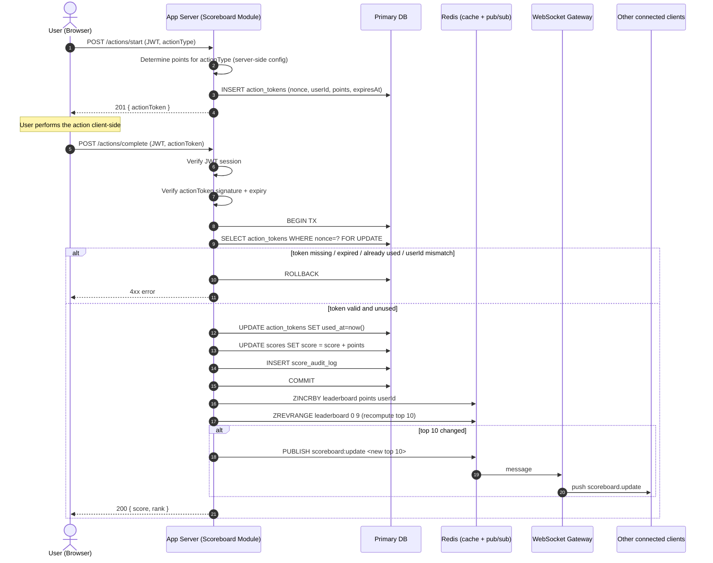

# Problem 6: Scoreboard API Module — Specification

This document specifies a backend module responsible for tracking user scores, serving a live top-10 leaderboard to the website, and accepting authorized score-increment requests when a user completes an action. It is written for the backend engineering team to implement; it is not itself an implementation.

## 1. Scope

**In scope**

- Recording a user's score increase when they complete an action.
- Preventing unauthorized or forged score increases.
- Serving the current top 10 scores.
- Pushing live updates of the top 10 to connected clients whenever it changes.

**Out of scope**

- What the "action" actually is (game move, task, quiz, etc.) — the module only needs to know that an action was authorized to start and was completed.
- Frontend implementation (the website consuming this API).
- User authentication/account system itself — this module assumes an existing auth service that issues a verifiable session (e.g. a JWT) and only consumes it.

## 2. Actors & Trust Boundaries

| Actor | Trust level | Notes |
|---|---|---|
| Authenticated user (browser) | Untrusted | Can be scripted/automated; must never be trusted to report its own score delta. |
| Application server (this module) | Trusted | Sole authority for score values and deltas. |
| Auth service | Trusted | Issues/validates user identity (JWT). Assumed to already exist. |
| Redis (cache/pub-sub) | Trusted, internal | Not internet-facing. |
| Primary database | Trusted, internal | Source of truth for scores. |

The core security principle of this spec: **the client never sends a score value or a score delta.** The client only asserts "I finished action X"; the server alone decides how many points that is worth, and only after verifying the assertion is legitimate.

## 3. Data Model

```
users
  id            PK
  username
  ...

scores
  user_id       PK, FK -> users.id
  score         integer, default 0
  updated_at    timestamp

action_tokens
  nonce         PK (random, 128+ bit)
  user_id       FK -> users.id
  action_type   string            -- what kind of action this token authorizes
  points        integer           -- server-decided reward for this action, fixed at issue time
  issued_at     timestamp
  expires_at    timestamp         -- short TTL, e.g. issued_at + 5 minutes
  used_at       timestamp, nullable

score_audit_log
  id            PK
  user_id       FK -> users.id
  delta         integer
  resulting_score integer
  action_type   string
  nonce         FK -> action_tokens.nonce
  ip_address    string
  created_at    timestamp
```

`action_tokens` and `score_audit_log` exist purely to support the anti-abuse flow (§5) and later investigation — they are not needed to answer "what's the top 10", which is served from `scores` (and cached in Redis, §6).

## 4. API Endpoints

All endpoints require a valid `Authorization: Bearer <JWT>` from the existing auth service unless noted. All responses are JSON.

### 4.1 `POST /api/v1/actions/start`

Called by the client right before the user begins the action. Returns a short-lived, single-use, server-signed token that binds "this specific user" to "this specific action" to "this specific reward amount."

Request:
```json
{ "actionType": "collect_coin" }
```

Response `201`:
```json
{
  "actionToken": "eyJhbGciOi...",
  "expiresAt": "2026-08-25T10:05:00Z"
}
```

The server decides `points` for `actionType` from server-side config/business rules — never from the request — and embeds it (plus `userId`, a random `nonce`, and `exp`) into the signed token.

### 4.2 `POST /api/v1/actions/complete`

Called by the client once the action finishes.

Request:
```json
{ "actionToken": "eyJhbGciOi..." }
```

Server-side, in order:
1. Verify the JWT session and extract `userId`.
2. Verify `actionToken` signature and expiry.
3. Verify the token's `userId` matches the session's `userId`.
4. Verify the token's `nonce` has not already been consumed (`used_at IS NULL`), atomically mark it used in the same transaction that applies the score change (see §5.2).
5. Apply `+points` to `scores.score` for the user.
6. Write a `score_audit_log` row.
7. Update the Redis leaderboard cache and publish an update event (§6).

Response `200`:
```json
{ "score": 1240, "rank": 7 }
```

Error cases: `401` (bad/missing session), `403` (token doesn't belong to caller), `409` (token already used), `410` (token expired), `429` (rate-limited, §5.3).

### 4.3 `GET /api/v1/scores/top?limit=10`

Public (or session-optional) read endpoint. Used for the initial page load, before the WebSocket connection delivers live diffs, and as a fallback for clients that don't support WebSockets.

Response `200`:
```json
{
  "entries": [
    { "userId": "u_123", "username": "alice", "score": 9820, "rank": 1 },
    { "userId": "u_456", "username": "bob", "score": 9310, "rank": 2 }
  ],
  "generatedAt": "2026-08-25T10:05:03Z"
}
```

### 4.4 `WS /ws/scoreboard`

WebSocket endpoint clients open once, on page load, to receive live updates.

Server -> client message, sent only when the **top 10 actually changes** (not on every score update elsewhere in the table):
```json
{
  "type": "scoreboard.update",
  "entries": [ { "userId": "u_123", "username": "alice", "score": 9820, "rank": 1 }, "..." ]
}
```

If WebSockets aren't viable in the target infra, Server-Sent Events (SSE) is an equally valid substitute for this one-directional push; the rest of the spec is unaffected.

## 5. Preventing Unauthorized Score Increases

This directly addresses requirement 5 ("prevent malicious users from increasing scores without authorisation"). Layers, in order of importance:

1. **Server decides the score delta, always.** `POST /actions/complete` never accepts a point value from the client. The only client-supplied thing is a token the server itself issued.
2. **Signed, single-use, short-lived action tokens.** The token from `/actions/start` is a JWT signed with a server-only secret. `/actions/complete` rejects it if the signature is invalid, it's expired (a few minutes' TTL), or its `nonce` was already consumed. This closes both forgery (can't fabricate a token without the server key) and replay (can't submit the same token twice to farm points).
3. **Token bound to the authenticated session.** The token's `userId` must match the JWT presented at completion time, so user A cannot spend a token issued to user B.
4. **Atomic consume-and-credit.** Marking the token used and crediting the score happen in a single DB transaction (§5.2), so a race of concurrent requests with the same token can't double-credit.
5. **Rate limiting per user/IP** (§5.3) on both `/actions/start` and `/actions/complete`, to blunt scripted/automated farming even with otherwise-valid tokens.
6. **Audit trail.** Every accepted score change is logged with `nonce`, `action_type`, and `ip_address` in `score_audit_log`, enabling after-the-fact anomaly detection and manual reversal if abuse is found.

Note what this spec deliberately does **not** attempt: verifying that the user "genuinely" performed the real-world action behind `actionType` (e.g. actually played fair). That requires domain-specific server-side verification of the action itself, which is explicitly out of scope (§1) since the task tells us not to care what the action is. What this spec guarantees is that a score increase cannot happen without a token the server itself issued to that specific user for that specific action, used exactly once, within its validity window.

### 5.1 Sequence Diagram



### 5.2 Concurrency

`scores.score` updates use either a single atomic `UPDATE ... SET score = score + :points WHERE user_id = :id` (relying on the DB row lock, not a read-modify-write in application code) or, if a document/NoSQL store is used instead, an atomic increment operation (e.g. Mongo `$inc`, DynamoDB `ADD`). The token-consume check and the score update must be in the same transaction (or, for a NoSQL store without multi-document transactions, a single conditional write keyed on the token) so that a duplicated/retried request cannot credit twice.

### 5.3 Rate Limiting

Apply a per-user (and secondarily per-IP) rate limit, e.g. via a token bucket in Redis, on both endpoints — a reasonable starting point is capping `/actions/start` + `/actions/complete` combined to something well above genuine human interaction speed for the specific action (exact number is a product decision, not an engineering one). Requests over the limit get `429`.

## 6. Live Update & Leaderboard Storage

- The authoritative score lives in the primary DB (`scores` table), but the **top 10 is served from a Redis sorted set** (`ZADD`/`ZINCRBY`/`ZREVRANGE`), not by scanning/sorting the full `scores` table on every request. This keeps `GET /scores/top` and the post-update top-10 recomputation O(log n).
- After every accepted score change, the server recomputes the top 10 from Redis and compares it to the previous top 10 it holds (in Redis, e.g. under a `leaderboard:last_broadcast` key). It only publishes to `scoreboard:update` if the top 10 (membership or ordering) actually changed — this avoids a broadcast storm from score changes that don't affect the visible board.
- Publishing goes through Redis pub/sub rather than the WebSocket gateway broadcasting directly from in-process state, so the module works correctly when the app server is horizontally scaled to multiple instances: every instance subscribes to `scoreboard:update` and forwards to the WebSocket connections it personally holds.
- On initial connection, a client hits `GET /scores/top` (or the gateway sends one synthetic `scoreboard.update` on WS connect) so it isn't blank until the next score change.

## 7. Suggested Implementation Notes for the Team

- `action_tokens.nonce` should be a cryptographically random value (e.g. UUIDv4 or 128-bit random), not sequential, so it can't be guessed.
- Sign `actionToken` as a JWT with a server-only secret (or asymmetric key if multiple services need to verify it) — don't just store the nonce client-side in the clear without a signature, or a user could hand-craft one.
- Expired/used tokens can be purged from `action_tokens` on a schedule (e.g. daily job removing rows older than 24h) to bound table growth; `score_audit_log` should follow the org's normal retention policy instead, since it's the abuse-investigation trail.
- Emit metrics (accepted vs. rejected `/actions/complete` calls, rejection reasons, rate-limit hits) so a spike in rejected/duplicate token attempts is visible to on-call rather than silently absorbed as 4xxs.

## 8. Additional Comments / Possible Improvements

These are suggestions beyond the minimum the requirements ask for, for the team to weigh — not blocking for a first implementation:

1. **Domain-specific action verification.** As noted in §5, this spec trusts "an action-start token was issued and later redeemed" as proof of legitimacy, but never confirms the user actually did the underlying action correctly. If the action is itself verifiable server-side (e.g. it's a server-authoritative game state, not purely client-side), consider having `/actions/complete` validate against that state instead of/in addition to just consuming a token — this closes the "client silently skips the action and calls complete immediately" gap.
2. **Anomaly detection.** Alert on statistically abnormal score velocity per user (e.g. more points in an hour than any legitimate top-10 user has ever earned) as a second line of defense behind the token scheme, and give admins a way to void/reverse a `score_audit_log` entry.
3. **Idempotency for network retries.** A client retrying `/actions/complete` after a timeout (but where the first request actually succeeded server-side) should get the same `200` response, not a `409`. Consider treating "token already used, but by this same request" as a safe no-op by keying idempotency off a client-generated request ID stored alongside the token consumption, rather than surfacing a hard error on legitimate retries.
4. **Score decay / seasons.** Not required, but scoreboards commonly reset periodically (daily/weekly/season). If that's ever wanted, the `scores` table and Redis keys should be namespaced by a `period_id` from day one — bolting it on later is a bigger migration.
5. **Privacy/retention of `ip_address`.** Storing IP in `score_audit_log` is useful for abuse investigation but is personal data in most jurisdictions; confirm a retention/purge policy with legal/compliance rather than keeping it indefinitely.
6. **CAPTCHA / step-up friction.** If rate limiting and token binding prove insufficient against sophisticated bot abuse, consider adding a challenge (e.g. CAPTCHA) to `/actions/start` specifically for accounts already flagged by the anomaly detector, rather than for all users by default (keeps UX friction targeted).
7. **WebSocket auth & scale.** The `/ws/scoreboard` channel as specified is read-only broadcast, so it can be left session-optional; if it's ever extended to carry per-user data, add JWT auth on the WS handshake. For scale beyond a single Redis pub/sub instance, consider a dedicated fan-out layer (e.g. Redis Cluster pub/sub sharding or a managed pub/sub service) once connection counts warrant it — not needed for an initial implementation.
